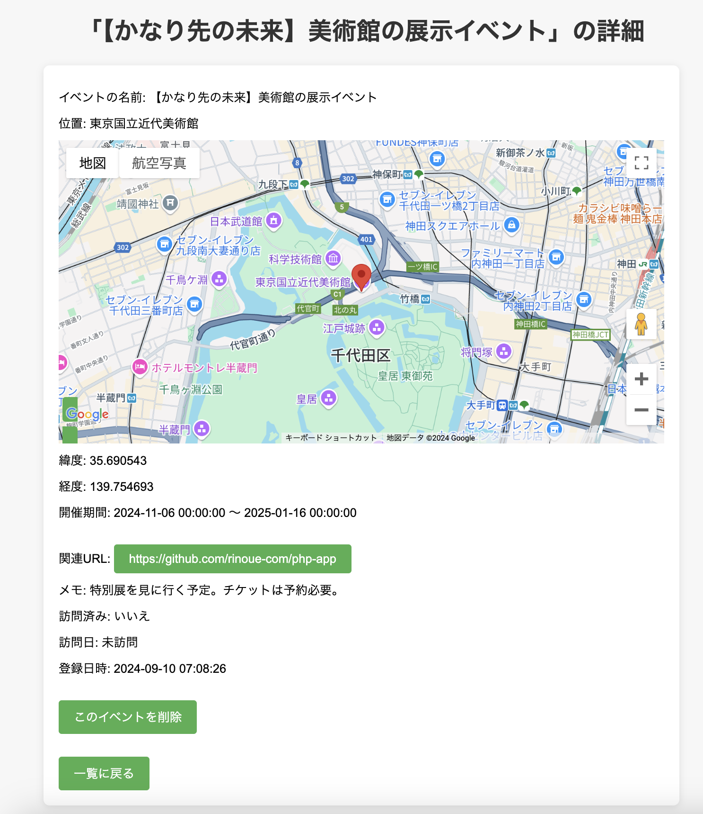

## ①課題番号-プロダクト名

行きたい場所/イベントを記録するアプリ

## ②課題内容（どんな作品か）

### 行きたい場所やイベントを、日時情報や位置情報を含めて記録・検索できるアプリ

- 行きたい場所の登録:
  - ユーザーは、行きたい場所やイベントの名前、位置情報、開催期間、関連URL、メモ、訪問フラグなどを入力して登録できる
  - Google Maps API を使用して場所の検索を行い、緯度・経度や場所名を自動取得
  - 未定の場合は日付入力をグレーアウト
- 行きたい場所の一覧表示:
  - 登録された行きたい場所の一覧がテーブル形式で表示され、イベント名、場所名、開始日、終了日、訪問フラグ、関連URLが表示される
  - 一覧画面には検索フォームがあり、イベント名や場所名で検索ができるほか、以下のフィルタ条件でリストを絞り込むことが可能
    - 未定: 開催期間が未定のイベントを表示
    - 訪問済み: 訪問済みのイベントを表示
    - 開始日の範囲指定: 指定された日付までのイベントを表示
- 詳細表示:
  - 一覧画面の各行にある「詳細を見る」リンクをクリックすると、その場所やイベントの詳細情報（緯度・経度、関連URL、訪問フラグなど）を表示
- データの削除機能
  - 一覧画面の各行にある「削除」ボタンをクリックすると、その場所やイベントのデータを削除
  - 詳細画面からも削除可能
  

## ③DEMO

データ一覧画面：http://localhost/php-app/bookmark-app/

## ④作ったアプリケーション用のIDまたはPasswordがある場合

特になし

## ⑤工夫した点・こだわった点

- Google Maps APIの活用による場所検索
  - ユーザーは、Google Maps APIを使って直感的に場所を検索可能。場所名（ランドマーク名や施設名）を入力でするだけで候補から選択ができ、緯度・経度とIDを自動的に取得してDBに登録する。
- 検索機能や絞り込み機能を実装
  - ユーザーが登録したデータを見やすくするため、検索フォームやフィルタ条件を実装した。イベント名や場所名で検索ができるほか、未定のイベントや訪問済みのイベント、開始日の範囲指定などでリストを絞り込むことが可能。 

## ⑥難しかった点・次回トライしたいこと(又は機能)

### 難しかった点

- データの削除機能の実装方法
  - 別のPHPファイルとして準備するべきかがよく分からなかった。次回の講義で学習した方法に修正予定。
- データベースの登録エラーがわかりにくかった。
  - フォームが空欄の場合、明示的にNULLにする必要があるが、予期せず空白の文字列が送られたりして、型のエラーが出たりしてしまった。

### 次回トライしたいこと

- 検索、絞り込み機能の改善
  - 検索と絞り込み機能を別にしてしまったため、絞り込み条件を入力しても検索結果がリセットされてしまう。検索結果を保持したまま絞り込み条件を適用できるように改善したい。
- データの更新機能
  - 時間の都合で実装ができなかった。詳細画面から登録したデータを編集・更新できるようにしたい。
  
## ⑦質問・疑問・感想、シェアしたいこと等なんでも

- [質問]
- [感想]
  - 場所の検索機能は、Google MapのAPIを使うことで、ユーザーが直感的に場所を検索できる機能を簡単に実装できた。GoogleマップのSDKは様々な高度な機能が用意されているようなので、今後も活用していきたい。
  - 以前の課題で作成した旅程計算アプリと連携させる機能も開発してみたい。
- [参考記事]
  - [Place Autocomplete(Google Maps API)](https://developers.google.com/maps/documentation/javascript/places-autocomplete?hl=ja)