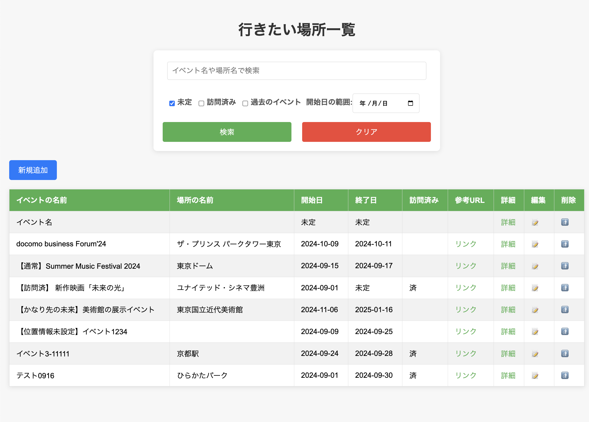

## ①課題番号-プロダクト名

行きたい場所/イベントを記録するアプリ（更新・削除あり）

## ②課題内容（どんな作品か）

### 行きたい場所やイベントを、日時情報や位置情報を含めて記録・検索できるアプリ

- 基本機能
  - 行きたい場所の登録:
    - ユーザーは、行きたい場所やイベントの名前、位置情報、開催期間、関連URL、メモ、訪問フラグなどを入力して登録できる
    - Google Maps API を使用して場所の検索を行い、緯度・経度や場所名を自動取得
  - 行きたい場所の一覧表示:
    - 登録された行きたい場所の一覧がテーブル形式で表示され、イベント名、場所名、開始日、終了日、訪問フラグ、関連URLが表示される
  - 一  覧画面には検索フォームがあり、イベント名や場所名で検索ができるほか、フィルタ条件でリストを絞り込むことが可能
  - 詳細表示:
    - 一覧画面の各行にある「詳細を見る」リンクをクリックすると、その場所やイベントの詳細情報（緯度・経度、関連URL、訪問フラグなど）を表示
- 追加・改善した機能
  - データの削除機能
    - 一覧画面の各行にある「削除」ボタンをクリックすると、その場所やイベントのデータを削除
    - 詳細画面からも削除可能
  - データの更新機能
    - 一覧画面の各行にある「編集」ボタンをクリックすると、その場所やイベントのデータを修正し更新登録することが可能
    - 詳細画面からも更新可能
  - 検索・絞り込み機能
    - 検索と絞り込みが同時に利用できるように改善
  

<!--  -->

## ③DEMO

データ一覧画面：https://tech-ryu.sakura.ne.jp/placemark-app

## ④作ったアプリケーション用のIDまたはPasswordがある場合

特になし

## ⑤工夫した点・こだわった点

- 更新処理を行う`update.php`の処理
  - 今後のことを考え、指定されたパラメーターのみを指定したSQL文を生成し、更新するようにした（→例：visited_flagのみ指定しても、えらーにならず必要部分のみ更新可能）
- 更新・削除処理の実行後にメッセージを表示
  - 更新・削除処理が正常に終了した場合、一覧画面にリダイレクトした後、画面右上に一時的にメッセージを表示するようにした

## ⑥難しかった点・次回トライしたいこと(又は機能)

<!-- ### 難しかった点

-  -->

### 次回トライしたいこと

- 絞り込み機能の改善
  - 前回の条件をローカルに記憶しておき、ページ遷移や更新削除時に元の状態を保持する機能
- ユーザ認証機能、ユーザごとにデータを記録できる機能
- ファイル(csv等)としてデータをダウンロード・アップロードできる機能
   
## ⑦質問・疑問・感想、シェアしたいこと等なんでも

- [質問]
- [感想]
  - 今週は作業時間が十分にとれなかったため、最低限の更新・削除機能の実装と前回の一部課題の改善に留まった
  - アプリの機能として、ユーザ認証やユーザごとのデータ管理機能を追加することは必須なため、次回講義を参考に実装を進めたい
- [参考記事]
  - [Place Autocomplete(Google Maps API)](https://developers.google.com/maps/documentation/javascript/places-autocomplete?hl=ja)