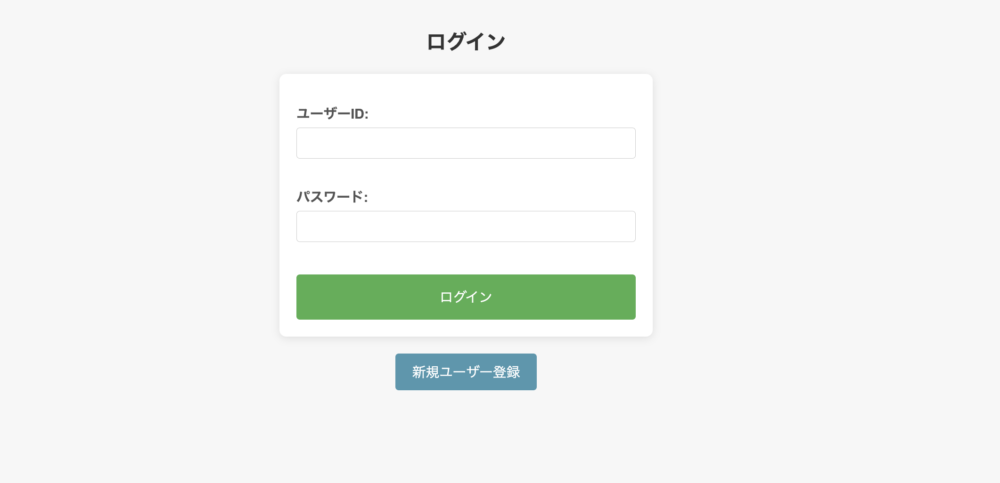

## ①課題番号-プロダクト名

行きたい場所/イベントを記録するアプリ（ログイン認証あり）

## ②課題内容（どんな作品か）

### 行きたい場所やイベントを、日時情報や位置情報を含めて記録・検索できるアプリ

- 基本機能
  - 行きたい場所の登録:
    - ユーザーは、行きたい場所やイベントの名前、位置情報、開催期間、関連URL、メモ、訪問フラグなどを入力して登録できる
    - Google Maps API を使用して場所の検索を行い、緯度・経度や場所名を自動取得
  - 行きたい場所の一覧表示:
    - 登録された行きたい場所の一覧がテーブル形式で表示され、イベント名、場所名、開始日、終了日、訪問フラグ、関連URLが表示される
  - 一  覧画面には検索フォームがあり、イベント名や場所名で検索ができるほか、フィルタ条件でリストを絞り込むことが可能
  - 詳細表示:
    - 一覧画面の各行にある「詳細を見る」リンクをクリックすると、その場所やイベントの詳細情報（緯度・経度、関連URL、訪問フラグなど）を表示
  - データの更新・削除機能
    - 一覧画面の各行にある「更新」「削除」ボタンをクリックすると、その場所やイベントのデータを編集や削除が可能
    - 詳細画面からも実行可能
- 追加・改善した機能
  - セッション管理、ログイン認証機能
    - ユーザーごとにデータを管理するため、ログイン認証機能を追加
    - ログイン画面からユーザー名とパスワードを入力し、認証を行う
    - ログイン後は、ユーザーごとに登録されたデータのみを表示
    - 編集や削除などはユーザ自身のデータのみに対して実行可能
    - 新規ユーザ作成機能、ログアウト機能も実装
  

<!--  -->

## ③DEMO

https://tech-ryu.sakura.ne.jp/placemark-login-app

## ④作ったアプリケーション用のIDまたはPasswordがある場合

- ID: test01, PW: test01  （デモ用データあり）
- ID: test02, PW: test02  （別ユーザのログインテスト用）

## ⑤工夫した点・こだわった点

- セッションIDによるログイン認証:
  - セッションが一致しない場合、ログインページにリダイレクト
- ユーザーごとのデータ制御
  - 各データに作成者のユーザーIDを保存し、ログイン中のユーザーだけが自分のデータを閲覧、編集、削除できるように制限。SQLクエリで user_id を条件にフィルタリング。
- ユーザー名の表示
  - ログイン中のユーザー名を左上に表示
- ログアウト後のステータスメッセージ表示
  - ログアウト後に、ログイン画面の右上に「ログアウトしました」とメッセージを表示

## ⑥難しかった点・次回トライしたいこと(又は機能)

- 気をつけていたが、一部でsession_startがうまく出来ていないことがあった。ログイン後にリダイレクトされるが、それが無限ループしてしまいエラーとなってしまった。
- ユーザーごとのデータ管理機能について、ユーザIDによる制御で他ユーザのデータにアクセス出来ないように制御するようにしたが、セキュリティ面で不十分な部分があるか可能性がある。時間があるときに改善を検討したい。
<!-- ### 難しかった点

-  -->

### 次回トライしたいこと

- 絞り込み機能の改善
  - 前回の条件をローカルに記憶しておき、ページ遷移や更新削除時に元の状態を保持する機能
- 他のユーザにデータを共有できる機能、ゲストで特定のデータを公開する機能など
- ファイル(csv等)としてデータをダウンロード・アップロードできる機能
   
## ⑦質問・疑問・感想、シェアしたいこと等なんでも

- [質問]
- [感想]
  - 今週は作業時間が十分にとれなかったが、最低限のユーザ認証機能だけでなく、ユーザごとのデータ管理機能を追加できたのは良かった。
  - ユーザごとのデータを管理する方法について、実際のアプリケーションを構築する前にもう少し勉強しておきたい。
- [参考記事]