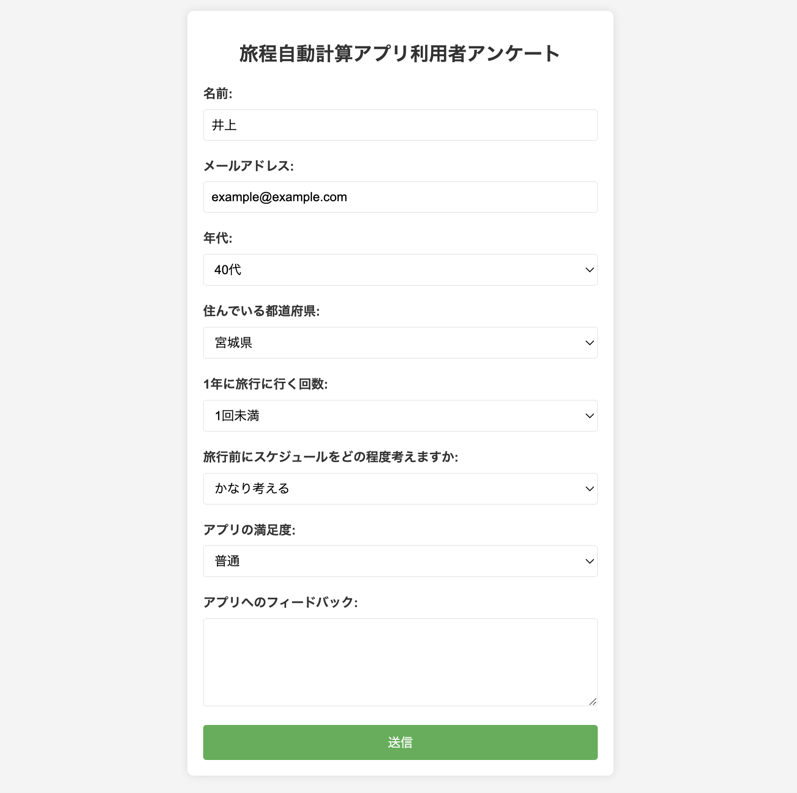
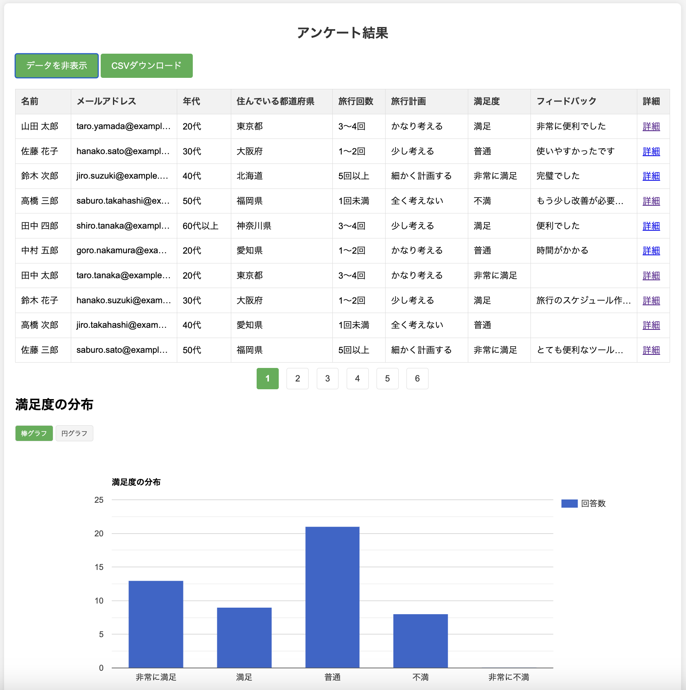

## ①課題番号-プロダクト名

アンケートアプリ（旅程自動計算アプリ 利用者向け）

## ②課題内容（どんな作品か）

### 旅程自動計算アプリ（前回の課題）の利用者を想定したアンケートシステムを制作

- アンケート回答の記録
  - ユーザーが入力したアンケートデータをCSV形式でローカルに保存し、結果画面で表やグラフで表示
- 回答結果のグラフ表示
  - Google Chartsを使用して、回答データを棒グラフや円グラフ、都道府県別の分布マップとして視覚的に表示
- ページング機能
  - 多数の回答データをページングで表示（1ページに10件ずつ表示）し、画面を見やすくした
- 省略表示と詳細表示機能
  - 長いデータについては隠すようにして表を見やすく表示している。また、各回答データの詳細を別ページで確認できる。
- CSVダウンロード機能
  -  結果ページからボタン一つで、全てのアンケート回答データをCSVファイルとしてダウンロード可能
- グラフ切り替え: 棒グラフと円グラフの表示をボタンで切り替えることが可能なため、用途によって可視化方法を動的に変更可能
  

## ③DEMO

アンケート回答画面：https://tech-ryu.sakura.ne.jp/survey-app/

アンケート結果確認画面：https://tech-ryu.sakura.ne.jp/survey-app/result.php

## ④作ったアプリケーション用のIDまたはPasswordがある場合

特になし

## ⑤工夫した点・こだわった点

- アンケートの回答データをデモ用に準備する際に、AIを利用して生成することで様々なパターンを短時間で準備できた。
- Google Chartsを利用して、アンケート結果をグラフで表示
  - 一般的なグラフだけではなく、地図形式のグラフも追加した

## ⑥難しかった点・次回トライしたいこと(又は機能)

### 難しかった点

- if分の書き方や文字列連結など基本的なプログラミングの記法でも、PHPの独特の文法に慣れていないため少し時間がかかった
- マップ形式の表示では、都道府県名の指定方法が最初間違っていてうまくいかなかった（"都","府","県"は不要だった）
  - Google Chartsにはドキュメントが十分にあるが、日本など地域特有の設定に関する情報が見つからなかった

### 次回トライしたいこと

- Firebase等を使ったユーザ認証機能の追加（管理者アカウントの作成）
- PHPのライブラリを使って、Excelファイルでの出力機能追加
  - composerを使ってライブラリを追加しようとしたが、うまくいかず今回は断念した。
- データの削除機能追加
  - CSVファイルに対して更新/削除の操作を行うのは現実的ではないため、今後データベースを学んだあとに実装することにした。 
- 二重に回答することを防止する機能（リロードで何度も投稿されないように）
  
## ⑦質問・疑問・感想、シェアしたいこと等なんでも

- [質問]
- [感想]
  - PHPのエラーがデフォルト状態ではどこにも表示されないため、デバッグが難しかった。（PHPファイルにコードを追加する方法以外に、Apacheのログにも出力されている・・？）
  - 今回は活用できなかったが、前回までの課題でAPIキーを使っていたものは、キーを隠匿できるようにPHP版に改修したいと思った
- [参考記事]
  - [Google Charts](https://developers.google.com/chart?hl=ja)